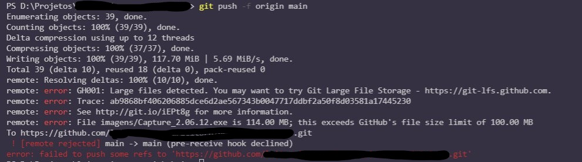

Então você tentou enviar as tuas alterações pro github e deu esse erro aqui:



O que aconteceu é que adicionou no seu repositório arquivos muito grandes que o git normalmente não consegue trabalhar de maneira eficiente. Por isso o GitHub criou uma extensão para o git que é o [Git LFS](https://git-lfs.github.com/). Mas isso é para quando você precisa versionar aquivos grandes.

Aqui vou falar de quando vc adicionou arquivos grandes ao repositório por engano. Por exemplo: vc copiou vários arquivos pra pasta comitou tudo usando o `git add .`.

Se a adição que vc fez aconteceu no _último_ commit vc pode rodar o comando `git reset HEAD~1` para desfazer o último commit e aí a referência ao arquivo nem chega a entrar no repositório. Entretanto se a adição ocorreu em commits anteriores então o buraco é mais embaixo devido a como o git salva os arquivos para versioná-los. [Esse vídeo](https://youtu.be/6Czd1Yetaac) do Fábio Akita explica melhor como funciona.

Mas então como posso remover esses arquivos grandes do repositório? 

Você vai precisar reescrever o histório dos commits para basicamente refazer os commits sem a referência para o arquivo que vc precisa remover. Mas calma, temos uma ferramenta para isso: o [BFG](https://rtyley.github.io/bfg-repo-cleaner/). Para usá-lo você precisa ter o java instalado na máquina e aí vc baixa o arquivo pelo link do site ali e pode rodar a ferramenta com o comando `java -jar bfg-1.14.0.jar`.

Feito isso, vamos aos passos para remover os arquivos indesejados:

1. Faça um backup do seu repositório.
   
    Este comando faz alterações destrutivas no seu histório então sempre é bom fazer um backup caso algo dê errado.

    Você pode fazer isso por exemplo fazendo um tarball da pasta do repositório com o comando `tar -czf backup_repo.tar.gz <pasta_repo>`

2. Entre na pasta do repositório que vc quer remover os arquivos.

3. Agora usamos o BFG pra limpar o repositório sob uma determinada condição, aqui no caso arquivos maiores de 100MB:

    ```bash
    java -jar bfg-1.14.0.jar --strip-blobs-bigger-than 100M 
    ```

    ou se quiser remover os arquivos por nome você pode usar o comando

    ```bash
    java -jar bfg-1.14.0.jar --delete-files <nome_arquivos>
    ```

    Isso não vai remover os arquivos fisicamente então precisamos do próximo passo

4. Entre no repositório bare e rode o comando

    ```bash
    cd <pasta_repositorio_bare>
    git reflog expire --expire now --all && git gc --prune=now --agressive
    ```

    Isso vai remover fisicamente os arquivos invalidados e fazer o garbage collect das referências invalidadas e limpar o repositório.

5. Enviar as alterações com o `git push`

    Finalmente, se você estiver ok com as alterações, já pode enviá-las para o repo de origem.


E pronto! Você removeu os arquivos maiores de 100MB do seu repo! O BFG tem outras opções inclusive para se vc quiser mover esses arquivos grandes para o Git LFS então sugiro dar uma olhada na página dele com mais detalhes.

Muito obrigado pela leitura, espero ter ajudado.

Reinaldo