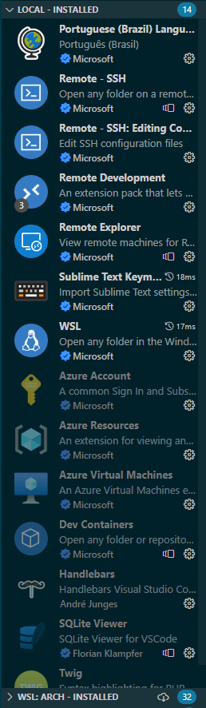

Ao longo do uso do VSCode, várias pessoas notam que ele vai ficando pesado, lento:

e consome absurdas quantidades de memória, ainda mais se tiver algo assim na árvore de diretórios:

Isso ocorre mais frequentemente quando adicionamos muitos projetos no mesmo workspace e/ou adicionamos muitos plugins nele, como para testar alguma linguagem ou plugin novo e acabamos esquecendo de desinstalá-los após testarmos. Ou ainda temos que trabalhar com vários ambientes diferentes que usam ferramentas completamente diferentes como rust, php, e o ecossistema Javascript (que inclui TS, nodejs, e os milhares de frameworks frontend e tooling).

Isso é tão importante que a extensão rust-analyzer, que é o _de facto_ language server de rust, não funciona se não adicionarmos um diretório controlado pelo cargo como root do workspace:

Segue o exemplo do worst case scenario que eu bolei aqui na minha máquina:

- Workspace com vários arquivos e projetos abertos
- Várias extensões instaladas que servem somente a um ou outro projeto

Os pacotes:

### Como resolver?

1. Abra somente o projeto que está trabalhando no momento e crie um workspace pra ele.

   Raramente precisamos abrir mais de um projeto ao mesmo tempo, e quando o fazemos é mais para consultar alguma coisa do que desenvolver algo. Então a lógica segue que adicionemos um projeto por workspace. As extensões, principalmente com os Language Servers, trabalharão com um número bem menor de arquivos para ler, logo suas execuções ficarão mais rápidas e leves.

   P: "Ah mas eu trabalho com monorepo, nx, husky e os c\*ralho, como faz?"
   R: Então vc deve entender seu repositório e decidir se vale a pena adicionar todo ele em um workspace ou não. Frequentemente é uma boa ideia já que são usadas ferramentas como husky ou git subrepos para controlar esses monorepos, além dos pacotes serem mais acoplados entre si.

   Segue o exemplo de um bom workspace:

   

2. Desative TODAS as extensões não essenciais de forma global.

   Exceto as que sejam como as de Remote (para vc poder acessar seus workspaces remotos) e que você use em TODOS os workspaces como os de configuração (ex: língua PT-BR) e os de bindings (ex: bindings do sublime, vim, emacs).

   Isso liberará os recursos necessários que não estão sendo necessários no momento nem por "acidente" embora eu creia que os editores de plugins façam um bom trabalho.

   <small>Lembrando que este artigo tem função de somente dar um exemplo de como eu configuro o sublime e eu tenho um viés com mais afinco no uso de memória que remete o meu gosto por linux então se vc quiser ter extensão X ou Y ativa sempre, se sinta à vontade.</small>

   Segue as extensões desativadas no workspace exagerado que criei de exemplo:

   
   
   
   

3. Ative SOMENTE as extensões necessárias no workspace.

   Aqui sugiro uma reflexão: todas as extensões que você tem instalado vc usa? Uma vez me peguei instalando o pacote completo de extensões para alguma lang e isso impactou meu sistema antigo na época (lembre, sua máquina não roda somente o VSCode). Ai verifiquei e vi que somente precisava do language server ou do sintax highlinghting e rodou como uma beleza. Entretanto, o contraponto: se tiver máquina sobrando, vai fundo, quem sabe vc tem um ganho de produtividade?

   Nesse workspace que eu criei pra editar este post, não necessito de nada em específico pois escrevo markdown direto então não habilitei nenhuma extensão fora do que já estava ativo. Entretanto, se o projeto fosse rust, eu habilitaria o rust-analyzer. Se nele ainda eu usasse por exemplo handlebars para linguagem de template de html eu a adicionaria àquele workspace. O bom de tudo isso é que elas vão estar configuradas por projeto então quando vc mudar de projeto via o Abrir Recente (Open Recent) elas carregarão automaticamente.

   Aqui o resultado de um cold start dos plugins neste novo workspace abrindo o wsl:
   
   
   

   Alguns comentários: 
   - No windows o wsl nem chegou a alocar todo o swap de 4gb coisa que no outro teste ele já tinha feito e, mesmo que o linux não o use, o wsl ainda mantém alocado.
   - Ainda no windows o vscode em si mantém o mesmo uso de memória por causa de ele estar no modo remote então todo o heavy lifting está concentrado no wsl.
   - A diferença entre o workspace anterior é brutal. Lógico, este workspace não demanda plugins, a ideia é evidenciar que você pode estar gastando mais recursos do que precisa pra uma tarefa que pode ou não ser simples. YMMV (testa ai e ser der boa, comenta).

### Finalizando

Obrigado pela leitura se chegou até aqui. :) Isso quer dizer que eu ter escrito esse tutorial já valeu a pena.

Como eu disse acima, seu caso pode ser diferente mas acredito que muitos podem se beneficiar dessas otimizações, especialmente os que não tem máquinas muito potentes para trabalhar. (Tentei usar no desespero um laptop de 2013 com 4gb de ram e um Pentium T4400 e percebi que pra testar as paginas o chrome gerenciava melhor a memória restringida do que o firefox que pensei que poderia trabalhar melhor no cenário mas isso é outra história lol)

Aprecio se tiverem algum comentário, podem fazê-lo abaixo e poderemos ter uma discussão interessante sobre o tema.

Meus links estão [aqui](/about).

Até.