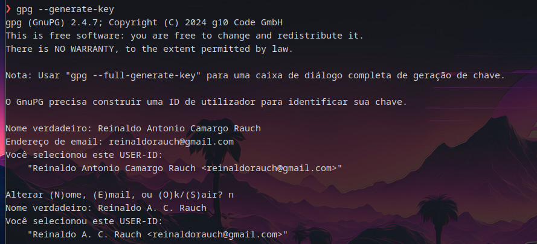
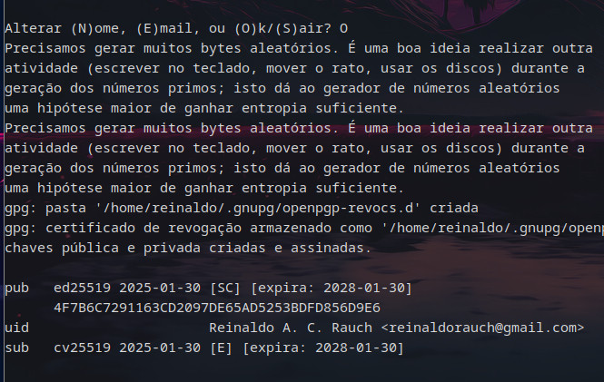
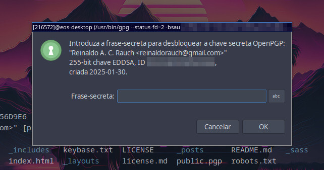
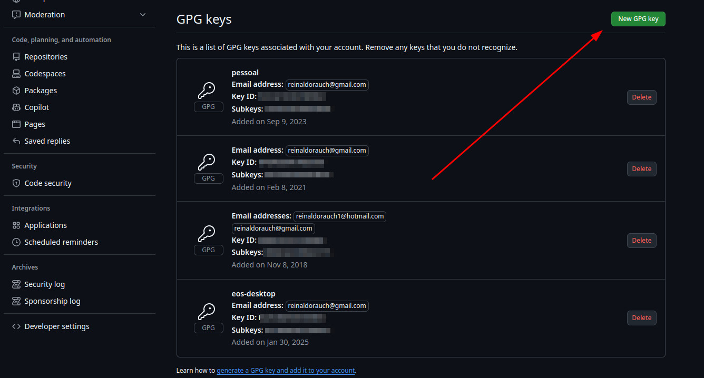
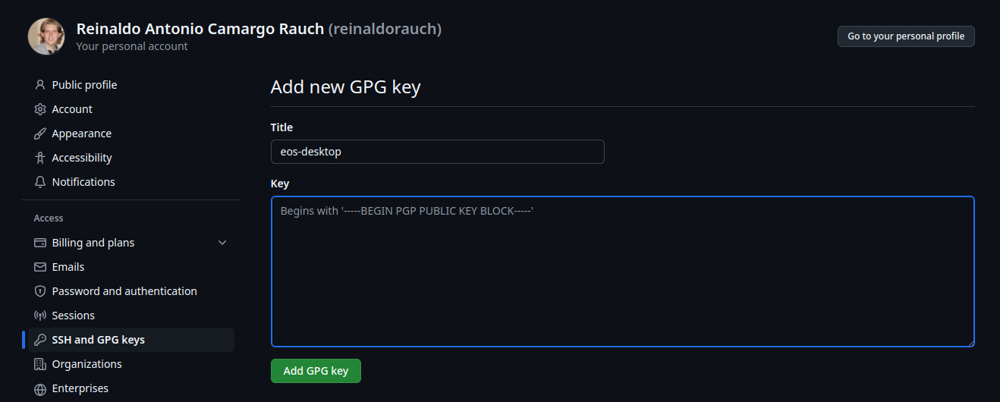
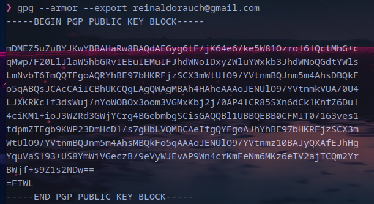
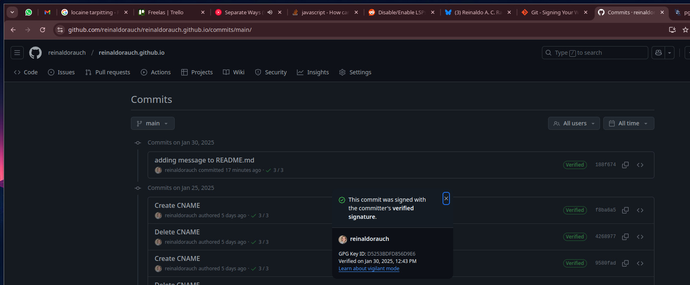
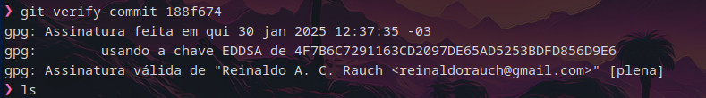

Obs: Originalmente publicado numa thread no [bluesky](https://bsky.app/profile/reinaldorauch.dev.br/post/3lgxv7m75lk2n)

Você pode estar se perguntando: mas se eu botar outro email e/ou nome na config
do git eu posso me passar por outra pessoa?


A resposta é SIM! Como o [@wilcorrea.dev](https://willcorrea.dev) salientou,vc
pode comitar com qualquer email e/ou nome que o git aceita de boa, é tipo botar
o nome do coleguinha no trabalho em vez do teu. O papel não vai impedir vc de
fazer isso mas dependendo do contexto isso pode ficar bem óbvio.

Mas calma! O próprio Git tem a solução (ish): Assinar os commits com uma chave
GPG. Pense como na blockchain (NÃO É IGUAL PLMDS), teu commit é criptografado de
modo que outra pessoa possa pegar ele e verificar que somente a pessoa em posse
de tal chave possa ter gerado aquele commit.

Como fazer? Primeiro vamos gerar uma chave GPG pessoal: (assumindo que vc tenha
o gpg instalado)

```sh
gpg --gen-key
```

Aí ele vai te perguntar seu nome e seu email (os mesmos que vc usa no git) e
logo depois ele pede uma senha pra desbloquear ela.

Digitando O, pronto! O gpg criou uma nova chave pra você!

|  |  |

E como usar ela pra assinar seus commits? Simples:

1. Configura o git pra usar a respectiva chave:

   ```sh
   git config --global user.signingkey <id_da_chave>
   ```

   Esse id da chave é o numerozão hexadecimal que aparece no gpg --list-keys ou a
   que apareceu no final da geração da chave.

2. Quando vc for commitar vc adiciona a opção -S no comando:

   ```sh
   git commit -S
   ```

   que diz pro git que vc quer assinar o commit com a chave que vc configurou.

   Aí depois da mensagem de commit ele vai te pedir pra desbloquear a chave pra
   vc poder assinar o commit.

   Pronto! Teu commit tá assinado, registrado!

   

Mas e aí? Não adianta nada assinar se não tem algum jeito de verificar depois.
Uma delas é vc configurar esta chave no seu github para que ele possa atestar
que foi você que gerou aquele commit:

Vá em Settings > SSH and PGP keys, desça na seção PGP keys

Clique em Add PGP key.



Vai aparecer para vc colocar um nome e o conteúdo da sua chave pgp pública.
E vc deve tá se perguntando o que raios é a tua chave PGP pública! Então, esse
esquema de encriptação é o de chaves assimétricas, em que vc usa uma chave
privada pra assinar (fica no teu pc) e outra pública pra verificar!


E como vc gera esse texto pra colar ali? Com o comando gpg abaixo, onde vc usa
o email pra identificar a chave que vc gerou:

```sh
gpg --armor --export <reinaldorauch@gmail.com>
```

que vai gerar o output na imagem, Aí é só copiar lá no form do github, e salvar!



Pronto! Agora o github já consegue verificar os seus commits assinados por essa chave:



E como vc aí na sua casa pode verificar também? Afinal, não podemos sempre
confiar em 3rd parties sempre.

Primeiro, vc deve baixar a chave pública de quem vc quer verificar o commit. A
minha pode ser baixada [aqui](../assets/public.pgp) e rodar o comando

```sh
gpg --import public.pgp
```

Agora vc pode clonar o repositorio do meu [blog](https://github.com/reinaldorauch/reinaldorauch.github.io)
e, na pasta, rodar o comando

```sh
git verify-commit <commit hash id>
```

e ele vai gerar um output como na imagem dizendo se foi verificado ou não.



E é isso! Segue mais dicas para assinatura de commits:

1. Assinar commits automaticamente:

   Para sempre assinar seus commits automaticamente configure o git:

   ```sh
   git config --local commit.gpgsign true
   ```

   para o repositório atual ou globalmente

   ```sh
   git config --global commit.gpgsign true
   ```

   Importante: os merges e tags também devem ser assinados, a config acima
   também faz merges serem assinados.

   Para assinar as tags também use a config:

   ```sh
   git config <--local|--global> tag.gpgsign true
   ```

   dependendo de qual contexto quer configurar.

2. Usar agente de chaveiro para gerenciar sua chave (deixar desbloqueado na
   sessão atual)

   Você deve ter percebido se vc acompanhou na sua máquina que toda vez ele
   pede a senha pra desbloquear a sua chave. Isso pode ficar chato/ruim se
   vc assinar vários commits/tags de uma vez. Logo, é recomendado usar um
   agente gerenciador de chaves (tal qual o que se usa com chaves ssh) para
   fazer essa manipulação por você. As maioria das distros modernas já vem
   algum deles configurado então é possível que você não precise fazer nada
   aí.

   Mas se não, vc vai precisar instalar e configurar um. Mas isso já tá
   fugindo do escopo dessa thread então vou deixar para um próximo post.

Muito obrigado pra quem leu até aqui,

Até a próxima!

PS: Segue os links que eu usei de referência para escrever essa thread:

- [Seção do livro Pro Git que fala de assinatura de commits (em inglês)](https://git-scm.com/book/en/v2/Git-Tools-Signing-Your-Work)
- [Como criar uma nova chave gpg no terminal (em inglês)](https://unix.stackexchange.com/questions/481939/how-to-export-a-gpg-private-key-and-public-key-to-a-file)
- [Como verificar as assinatura dos commits no terminal (em inglês)](https://stackoverflow.com/questions/17371955/verifying-signed-git-commits)
- [Como adicionar uma chave pública ao chaveiro local no terminal (em inglês)](https://superuser.com/questions/999286/how-to-install-public-keys-with-gpg)
